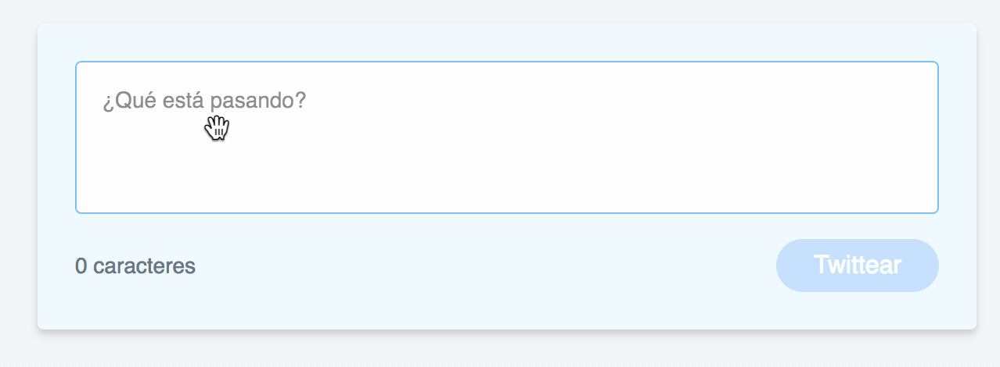
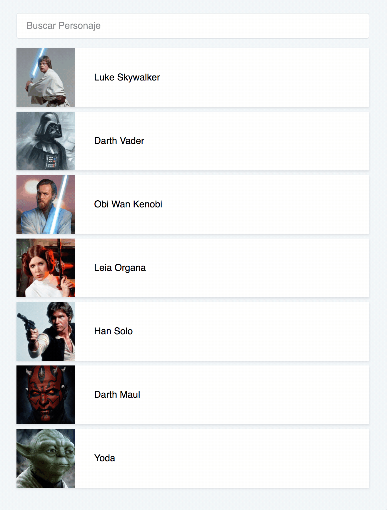

# Introduction to VueJs

This is a VueJs project for a talk titled "Introduction to VueJs". 
I showed this example @ Frontend Dev Guayaquil Meetup in Guayaquil, Ecuador.

There are three demos in this project. All 3 consist in VueJs components showcasing various features:
data and computed properties, directives, methods, among others.

## Demos
 
- Today component: Displays current date/time when rendered
- Compose Tweet component: Showcases a similar form from Twitter's official website.



- Star Wars Characters component: lists some of the movie characters and enables filtering.




## Build Setup

``` bash
# install dependencies
npm install

# serve json-server at localhost:3004
npm run server

# build css using Tailwind Css
npm run tailwind

# serve with hot reload at localhost:8080
npm run dev
```
